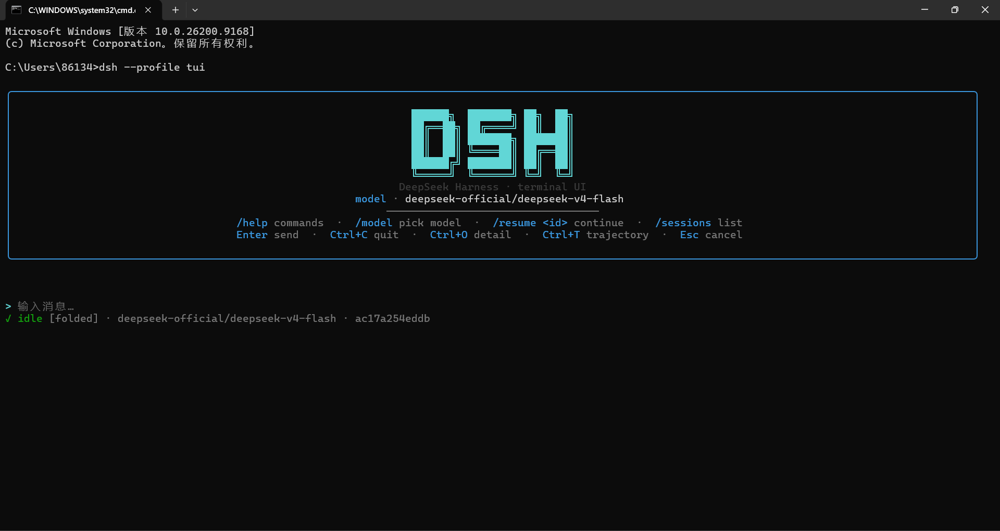
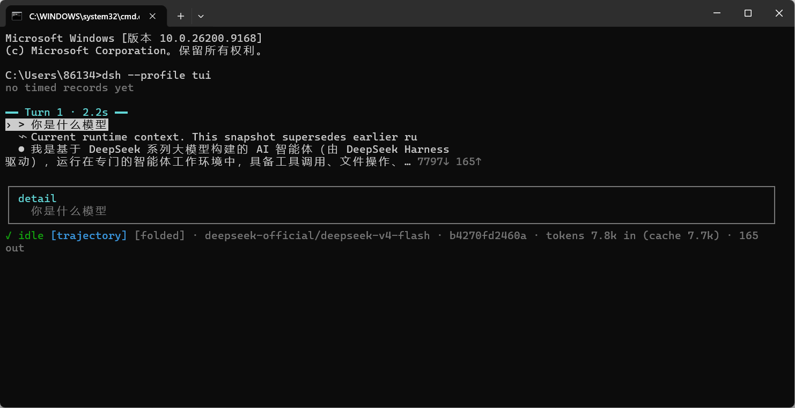

<p align="center">
  
</p>

<h1 align="center">dsh-tui</h1>

<p align="center">
  <strong>DeepSeek Harness 的终端界面</strong> · 流式转录、工具卡片、斜杠命令、轨迹视图、多厂商模型管理
</p>

<p align="center">
  <a href="#安装"><strong>安装</strong></a> ·
  <a href="#功能"><strong>功能</strong></a> ·
  <a href="#快捷键"><strong>快捷键</strong></a> ·
  <a href="#斜杠命令"><strong>斜杠命令</strong></a> ·
  <a href="#添加第三方厂商"><strong>添加厂商</strong></a> ·
  <a href="#架构"><strong>架构</strong></a>
</p>

---

`dsh-tui` 是 [DeepSeek Harness](https://github.com/deepseek-ai/deepseek-harness) 的一个**第三方、可安装插件**。把它挂进任意 `dsh` profile，终端就接管整个交互表面——无需修改 launcher。

它完全建立在 harness 的公开宿主接缝（`userQuestions`、`approval`、`commands`、`sessionQuery`、`session/event`、`tools`、`llm`、`credentials`、`settings`）之上，因此可以和 Web GUI、ACP、headless 等其他表面并存于同一套会话数据之上。

---

## 为什么是它

- **Claude Code 式的终端美学**：无边框、靠缩进 + 符号 + 颜色组织信息（`>` 用户、`✻` 思考、`⏺` 工具、`⎿` 输出），干净、耐读。
- **零 launcher 改动**：它是一个 `dsh.bundle` 插件，`dsh plugin add` 一条命令装上即用。
- **会话即真相**：转录和轨迹视图消费同一份 `session/event` 数据，切换视图不丢上下文，resume 后完整回放。
- **多厂商开箱即用**：通过 `llm-pi-ai` 的 OpenAI 兼容路由，可随时添加任意第三方网关与模型。

## 截图

### 启动欢迎框

<p align="center">
  
</p>

### 轨迹视图

<p align="center">
  
</p>

> 在真实终端中运行 `dsh --profile tui` 查看完整交互效果。

## 安装

### 从 GitHub 安装（推荐）

```sh
dsh plugin --profile tui add github:ht426/deepseek-harness-tui
dsh --profile tui
```

`dsh plugin add` 会自动初始化 profile（基于 `dsh-base`），把本插件的 `cordis.patch.yml` 挂载到组合栈上。之后 `dsh --profile tui` 即可启动。

### 本地开发安装

```sh
git clone https://github.com/ht426/deepseek-harness-tui.git
cd deepseek-harness-tui
pnpm install
pnpm run build
dsh plugin --profile tui add .
dsh --profile tui
```

> **前提**：需要已安装的 `dsh` CLI（来自 DeepSeek Harness），以及一个可用的 API key（通过 `/apikey` 或环境变量提供）。

## 功能

- **流式转录**：用户/助手消息、思考块（可折叠）、工具卡片（终端/通用/diff 渲染意图）、上下文注入、todo 列表、命令记录。
- **轨迹视图**（`Ctrl+T`）：turn 感知的事件台账 + ASCII 概览时间轴，可逐条展开查看原始输入/输出、耗时、token。
- **交互式选择器**：`/model` 和 `/permission` 裸输入时弹出上下键选择菜单。
- **提问 / 审批弹窗**：完整接住 `ask_user_question` 与权限审批。
- **多厂商管理**：`/addprovider` 添加 OpenAI 兼容网关，`/apikey` 存 key，`/model` 切换。
- **会话管理**：`/sessions` 列表、`/resume` 恢复、`/rename` 重命名、`/clear` 清空、`/export` 导出。

## 快捷键

| 键 | 作用 |
|---|---|
| `Enter` | 发送消息 |
| `Ctrl+C` | 退出 |
| `Ctrl+O` | 循环转录详情（`folded` / `expanded` / `hidden`） |
| `Ctrl+T` | 切换 chat ↔ trajectory 视图 |
| `Esc` | 取消弹窗 / 返回 chat |
| `↑` / `↓` | 轨迹视图中移动光标 |
| `Enter`（轨迹） | 展开/收起当前记录 |
| `t`（轨迹） | 切换概览时间轴 |

## 斜杠命令

### 内置命令

| 命令 | 说明 |
|---|---|
| `/help` | 列出所有命令 |
| `/quit` `/exit` | 退出 |
| `/clear` | 清空当前对话（开新会话） |
| `/new` | 新建会话 |
| `/resume <id>` | 恢复指定会话 |
| `/sessions` | 列出最近会话 |
| `/rename <title>` | 重命名当前会话 |
| `/status` | 显示会话/模型/token 状态 |
| `/model [provider/model]` | 列出或切换模型 |
| `/providers` | 列出可配置厂商 |
| `/apikey <ENV_VAR> <key>` | 存储 API key |
| `/addprovider <route> <baseURL> <ENV_VAR> <model,model,…>` | 添加 OpenAI 兼容厂商 |
| `/export [path]` | 导出当前会话日志为 JSON |

### 组合继承的命令

由 `dsh-base` 提供，同样可用：`/plan`、`/compact`、`/goal`、`/feedback`、`/permission` 等。

## 添加第三方厂商

`dsh-base` 以休眠态挂载了 `llm-pi-ai`，它接受任意 OpenAI 兼容路由。三步接入：

```sh
# 1. 声明厂商（route、baseURL、key 环境变量名、模型列表）
/addprovider openai https://api.openai.com/v1 OPENAI_API_KEY gpt-4o,gpt-4o-mini

# 2. 存 API key
/apikey OPENAI_API_KEY sk-xxxx

# 3. 切换到新模型
/model          # 弹出菜单，选择 openai 下的模型
```

`/addprovider` 写入 `llm-pi-ai` settings section（路由 + baseURL + apiKeyEnv + `openai-completions` 协议 + 模型），`/apikey` 通过 `ctx.credentials` 存储凭证。**无需重启**——settings section 一旦写入，路由即热注册，下次 `/model` 即可看到。

> **协议说明**：当前 `/addprovider` 固定使用 `openai-completions` 协议，覆盖绝大多数第三方网关（OpenAI、DeepSeek、通义、硅基流动等）。若厂商使用 `openai-responses` 协议，需手动在 settings 中调整。

## 架构

```
cordis.patch.yml      挂载宿主插件（无 launcher 改动）
src/host.tsx          apply(ctx)：把宿主接缝接到 store + ink
src/transcript.ts     纯函数折叠：session 事件 → 渲染节点
src/trajectory.ts     纯函数折叠：session 事件 → turn 台账（含原始参数/耗时）
src/store.ts          可观察快照，桥接 Cordis 事件与 React
src/render/*.tsx      ink 组件：转录、轨迹、输入框、状态栏、弹窗
src/markdown.tsx      markdown → ink 元素
src/command-args.ts   斜杠命令参数解析（纯函数）
```

设计原则：

- **host 拥有终端、agent 循环与生命周期**；渲染层是对快照的纯展示，可脱离真实 harness 单元测试。
- **双 fold**：`Transcript`（渲染优化）与 `TrajectoryFold`（保留原始 args/耗时）各司其职，都从 `session/event` 增量折叠。
- **模型切换原地进行**：通过 per-agent 可变 `ModelSelectionRef`，不重建会话、不丢上下文。

## 开发

```sh
pnpm install
pnpm run typecheck   # tsc --noEmit
pnpm run test        # vitest
pnpm run build       # tsup → dist/
```

## 许可

MIT
